# [charmed-arcana](https://geraldine-mor.github.io/charmed-arcana)

Developer: Geraldine Morey ([geraldine-mor](https://www.github.com/geraldine-mor))

Charmed Arcana is a website for a tarot reader/spiritual guide. The primary goal of the website is to introduce the user to tarot and encourage people to engage with the services through calls to action placed throughout. The site is aimed at individuals who are curious about tarot and wish to find out more. The users need information about the services offered, tarot cards and the site owner.

The evening I submitted my first project ([Rathnure RowFit](https://github.com/geraldine-mor/rathnure-rowfit)), I dreamed about a tarot card game website where the tarot cards would rotate to reveal a card. At that stage I didn't even know if that was something that JavaScript would handle, but as time went on I began to see how it might be done and the decision to pursue it as the main idea for project 2 was made.

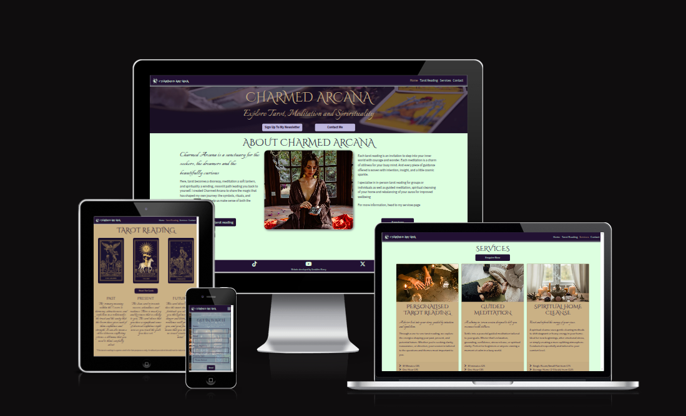

source: [charmed-arcana amiresponsive](https://ui.dev/amiresponsive?url=https://geraldine-mor.github.io/charmed-arcana)

## UX

### The 5 Planes of UX

#### 1. Strategy

**Purpose**
- Encourage users to book the services offered
- Provide an interactive user experience to keep users entertained and promote engagement through contact form, email signup and social media links
- Allow users to explore Tarot through a simple tarot reading game.

**Primary User Needs**
- Learn about tarot
- Find out what services are being offered
- Book services or contact provider
- Access engaging, responsive & interactive content
- Generate a tarot reading

**Business Goals**
- Sell or Book the services offered
- Increase social media engagement
- Increase ezine subscriptions
- Inform users about tarot

#### 2. Scope

**[Features](#features)** (see below)

**MVP Summary**
> A responsive, engaging tarot and spirituality website that promotes the business services, enables contact/booking through a simple form, grows the the business audience through email signup and social media links and includes a JavaScript tarot reading game.

**Content Requirements**
- Clear labels and instructions for input and operator buttons.
- Error messages for invalid inputs.
- Interactive tarot reading game.
- Ability to connect with site owner.

#### 3. Structure

**Information Architecture**
- **Navigation Menu**:
  - Clear accessible links visible at all times via a clean and simple navbar.
- **Hierarchy**:
    - Call to action buttons placed throughout and clearly visible
    - Social media links placed in the footer in a visually appealing way 
    - Clear and prominent placement of the input fields and operator buttons. 
    - Visible results and error messages.

**User Flow**
- User lands on the homepage &rarr; learns about the brand
- Browses the about information &rarr; decides whether to engage further via the tarot game or services page
- Navigates to the tarot game &rarr; engages with tarot in a fun & playful way
- Navigates to the services page &rarr; gains an insight into what services are available
- Contacts the site owner via enquiry form

#### 4. Skeleton

**[Wireframes](#wireframes)** (see below)

#### 5. Surface

**Visual Design Elements**
- **[Colours](#colour-scheme)** (see below)
- **[Typography](#typography)** (see below)

### Colour Scheme

When working on PP1 I had accidentally created colour #221133 and liked it but couldn't use it in that project. When the concept for PP2 appeared (in a dream), it utilised the deep aubergine already admired paired with a pale pastel mint green #ddffe0. So I decided to use these as the base colour scheme.

I used [coolors contrast checker](https://coolors.co/contrast-checker/ddffe0-221133) to ensure good contrast beween the 2 primary colours.

When I was creating tarot cards to use in the game (with [adobe firefly](https://firefly.adobe.com/generate/image)), I had asked it to use #221133 as the background colour and the cards were generated with a gold or sand line image. I used figma colour picker to find the hex code for that which is #cab185. I used coolors palette generator to find 2 alternative highlight colours that fit the calming spiritual theme.

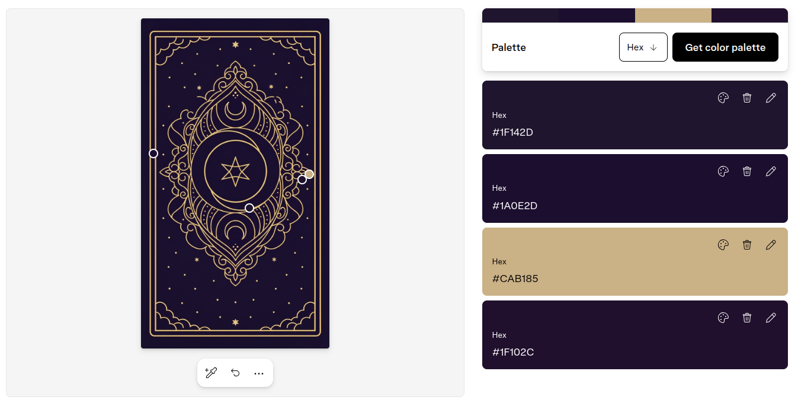

I used [coolors.co](https://coolors.co/221133-ddffe0-cab185-beb7df-aac6d7) to generate my color palette.

- `#221133` primary dark shade.
- `#ddffe0` primary light shade.
- `#cab185` primary highlights.
- `#beb7df` secondary highlights.
- `#aac6d7` secondary highlights.

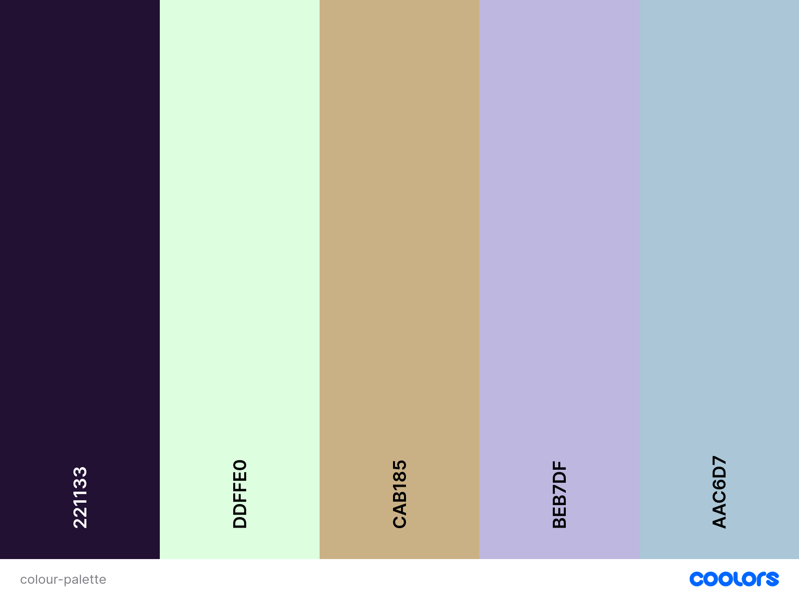

Contrast checks were performed on all colour combinations.  All accent/highlight colours have good contrast with the main dark colour (#221133) but all have terrible contrast with each other (the best of which is detailed below) so can only be used with & against the primary dark colour.

| Combination | Screenshot |
| ----- | ----- |
| primary-dark vs primary-light | 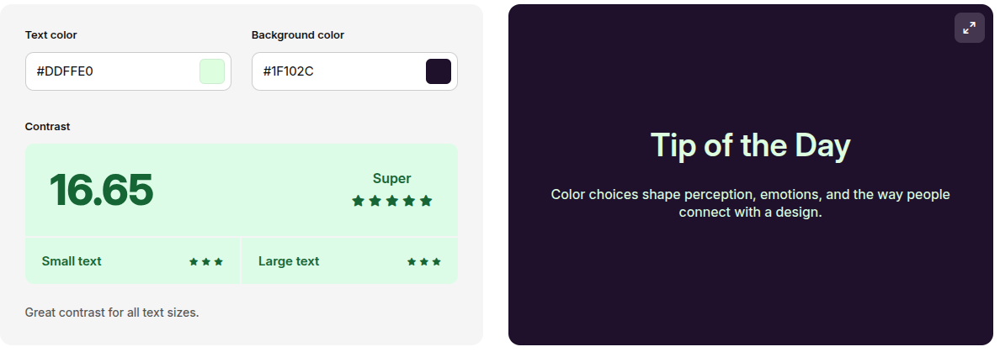 |
| primary-dark vs accent-sand | 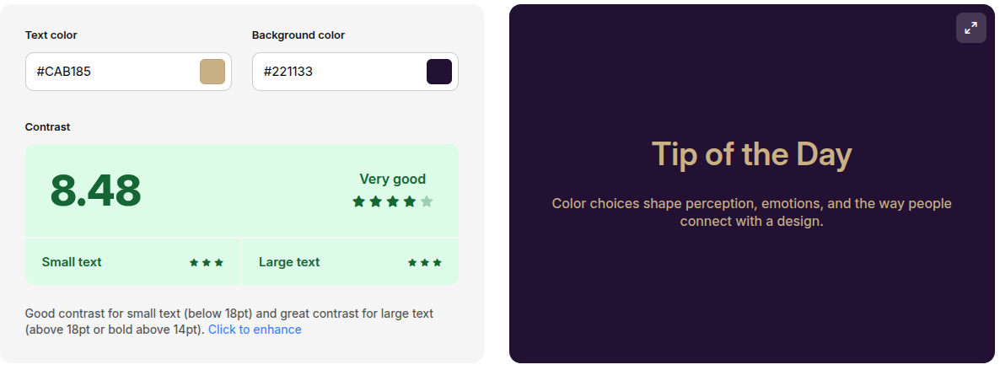 |
| primary-dark vs accent-lilac | 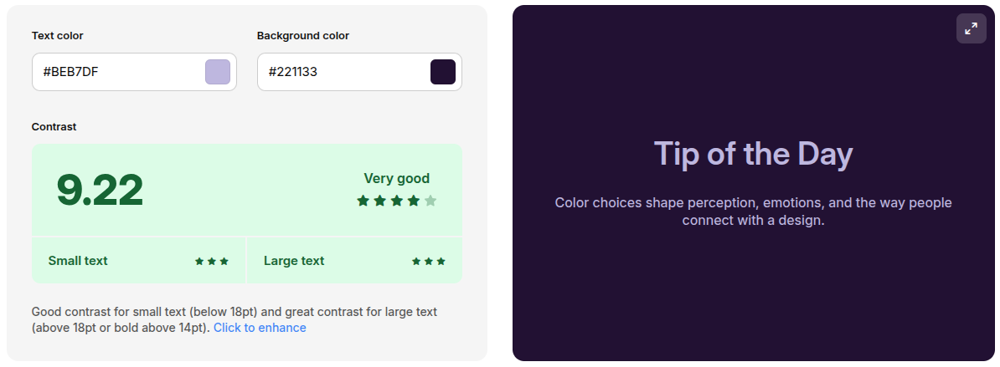 |
| primary-dark vs accent-blue |  |
| accent-lilac vs primary-light | 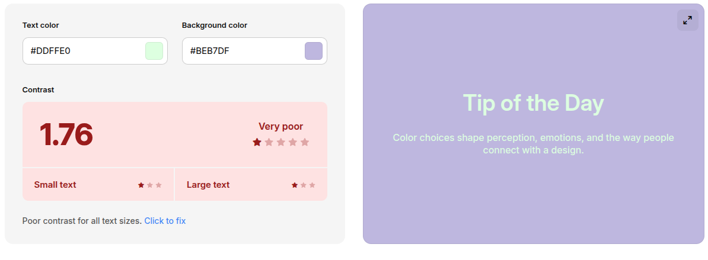 |

### Typography

I used [google fonts](https://fonts.google.com/?categoryFilters=Feeling:%2FExpressive%2FArtistic;Appearance:%2FTheme%2FMedieval;Serif:%2FSerif%2FOld+Style+Garalde) to show suggestions for fonts based on selected filters: *Old Style*, *Medieval* & *Artistic* and [Cinzel Decorative](https://fonts.google.com/specimen/Cinzel+Decorative?preview.text=CHARMED%20ARCANA&query=Cinzel) was suggested.

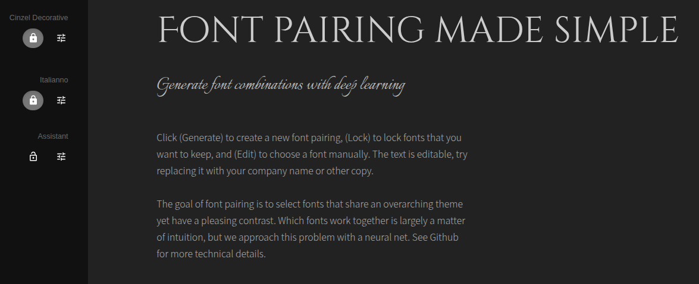
I used [fontjoy](https://fontjoy.com/) to explore complimentary fonts deciding on:

- [Cinzel Decorative](https://fonts.google.com/specimen/Cinzel+Decorative?preview.text=CHARMED%20ARCANA&query=Cinzel) was used for the primary headers and titles.
- [Assistant](https://fonts.google.com/specimen/Assistant) was used for the body text.
- [Italianno](https://fonts.google.com/specimen/Italianno?categoryFilters=Feeling:%2FExpressive%2FSophisticated) was used for accents and expressive text.
- [Font Awesome](https://fontawesome.com) icons were used throughout the site, such as the social media icons in the footer.

## Wireframes

To follow best practice, wireframes were developed for mobile, tablet, and desktop sizes.
I used [Balsamiq](https://balsamiq.com/wireframes) to design my site wireframes.

| Page | Mobile | Tablet | Desktop |
| --- | --- | --- | --- |
| Home | 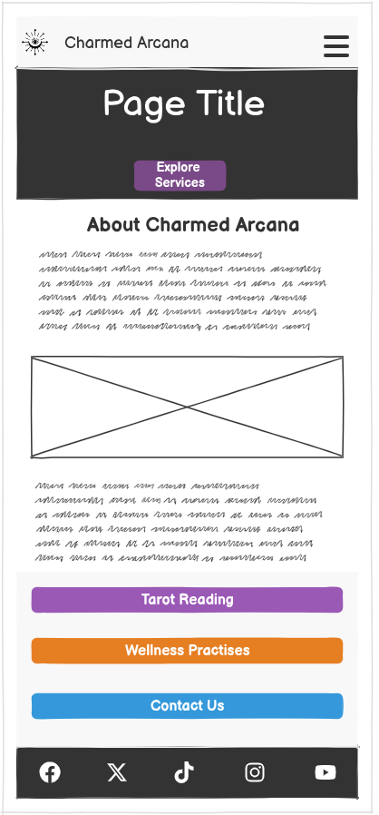 | 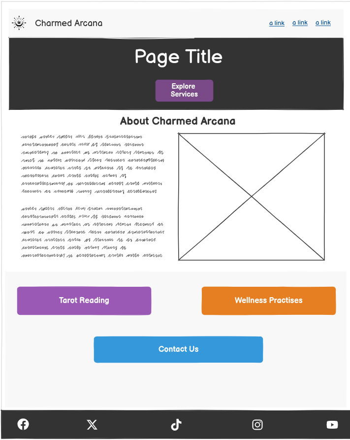 | 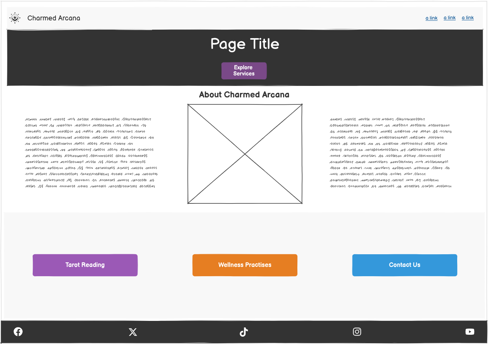 |
| Tarot Reading | 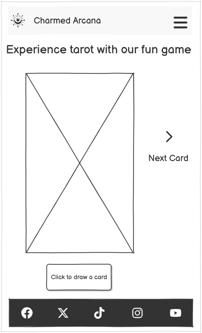 |  | 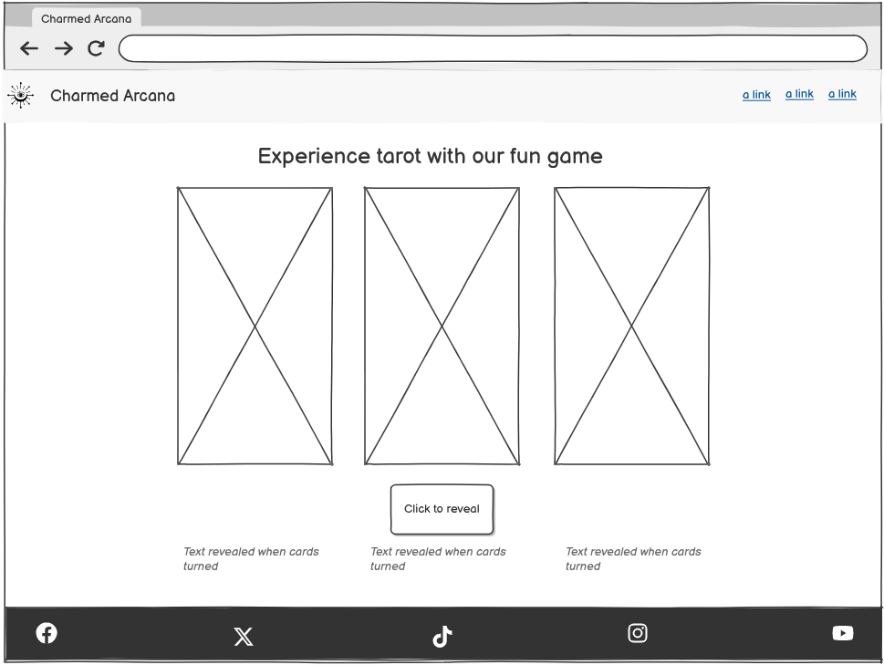 |
| Services | 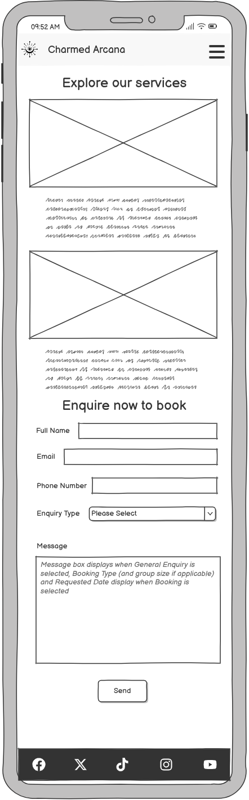 | 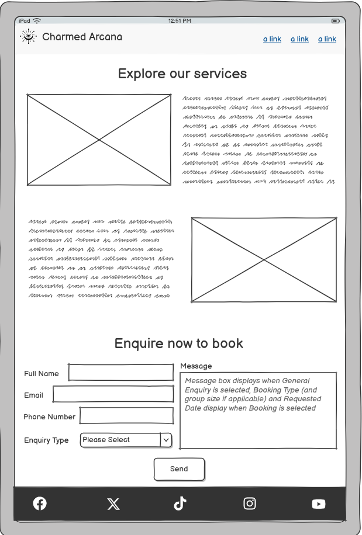 | 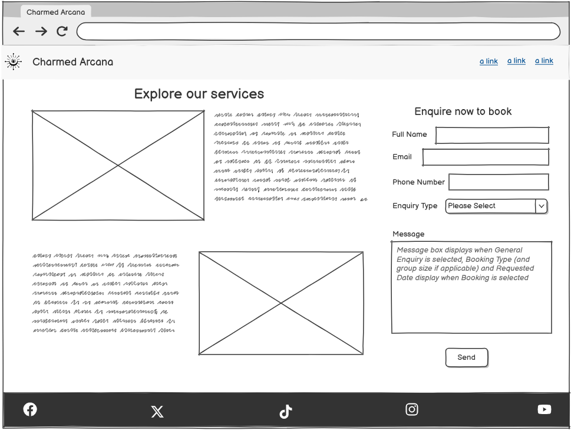 |
| 404 | 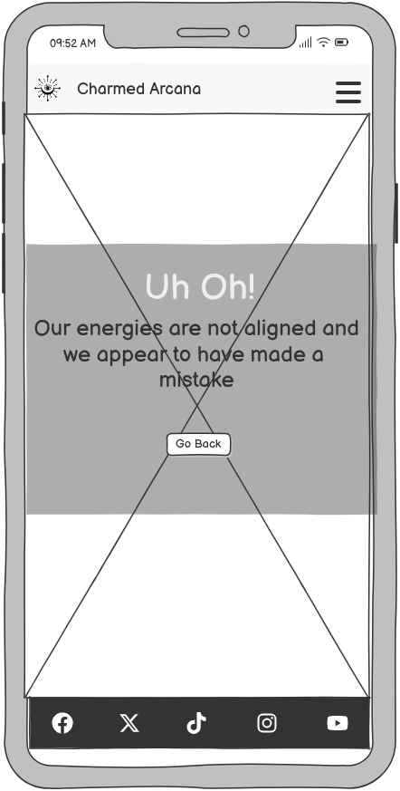 | 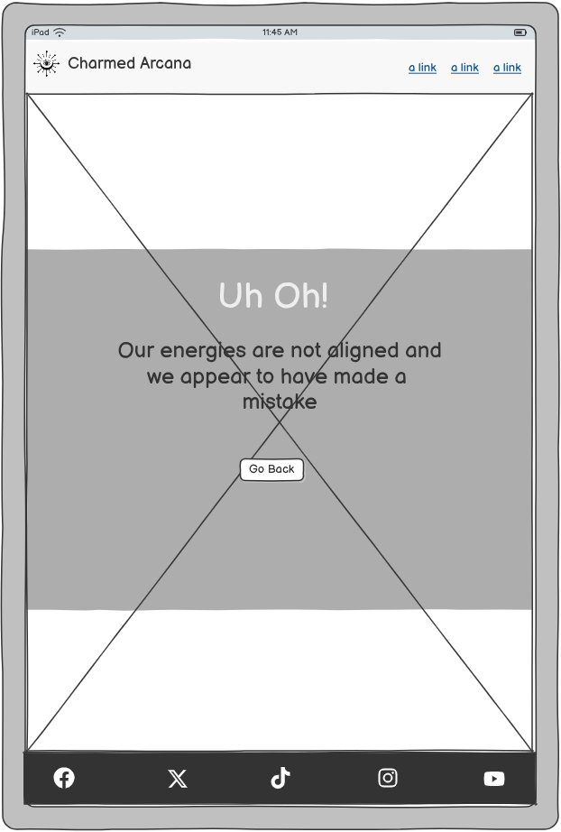 | 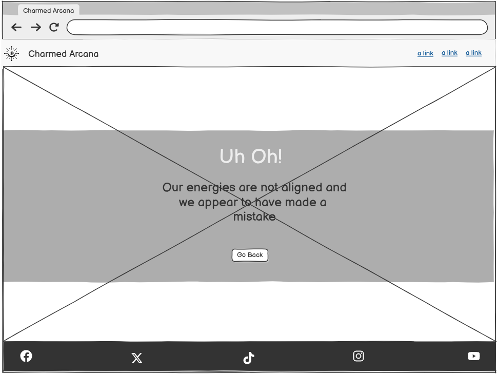 |

## User Stories

Created wtith assistance from chatGPT

| Target | Expectation | Outcome |
| --- | --- | --- |
|As a visitor | I want to easily navigate the site | to find all the information I need quickly and easily |
| As a visitor | I want to view the overall mission and purpose of the site | so that I feel connected to its purpose |
| As a visitor | I want to understand what the website offers | so that I know whether is fits my spiritual interests |
| As a potential customer | I want to see information about the services provided | so that I can see if they fit my needs |
| As a potential customer | I want to complete an enquiry form | so that I can ask questions about the services |
| As a customer | I want to complete a booking form | so that I can conveniently book a session |
| As a user | I would like clear labels and instructions | so that I understand how to use the app without confusion. |
| As a customer | I want to receive confirmation of booking/enquiry | so that I know my message was sent |
| As a potential customer | I want to view pricing clearly | so that I understand the costs before I book |
| As a visitor | I want to play a simple tarot reading game | so that I can engage with tarot in a fun way |
| As a visitor | I want the game to give me a brief interpretation of the chosen card | so that I gain insight or reflection |
| As a visitor | I want to sign up for regular emails | so that I can receive updates, readings or wellness tips |
| As a user | I want confirmation that I signed up successfully | so that I know I'm on the mailing list |
| As a user | I want to access the tarot reader’s social media accounts directly from the website | so that I can follow for updates and content |
| As a user | I want social links to be visible and accessible | so that I can find them quickly and easily |
| As a visitor | I want the website to load quickly | so that I have a smooth experience |
| As a visitor | I want the website to feel calm, magical, and welcoming | so that it aligns with the spiritual theme |
| As the site owner | I want to manage bookings from a dashboard or email notifications | so that I can stay organised |
| As the site owner | I want to view or export email subscribers | so that I can manage my mailing list |
| As a potential customer | I want to view the tarot reader's contact information | so that I can contact them for information or bookings |
| As a user | I would like to see a 404 error page if I get lost | so that it's obvious that I've stumbled upon a page that doesn't exist. |

## Features

### Existing Features

| Feature | Notes | Screenshot |
| --- | --- | --- |
| Navbar | The navigation links for the website are contained within the navbar as per user expectations. The navbar utilises a dropdown menu activated by a menu button to enable it to collapse on smaller screens |  |
| Footer | Social Media links are all stored in the page footer which is placed at the bottom of the page. All links open in a new tab and offer user feedback to show that they are clickable |  |
| Landing Page  | The landing page displays a clear purpose of the website with engaging images and easy to read text |  |
| Tarot Game | The user can play a game to receive a simple 3-card tarot reading. |  |
| Tarot Game Interactions | When the user clicks the game button, the cards are revealed and corresponding text is displayed. Cards are chosen randomly from a 22 card deck |  |
| Services Page | The website displays the available services in a well laid out manner with images to reinforce the message |  |
| Pricing | The services page displays pricing and duration of services clearly |  |
| Contact Details | The website clearly displays the business' contact details |  |
| Enquiry Form | The website has an easy to use enquiry form that allows the user to contact the site owner directly with general or booking enquiries |  |
| Form Success Message | The form displays a success message on comletion of the form |  |
| Newsletter Signup | The website offers the user the opportunity to sign up to the newsletter |  |
| Email Signup Success Message | The user receives feedback that they have successfully signed up to the newsletter |  |
| 404 error page | When the user clicks abroken link or mistypes apage address, a custom error message is displayed to let them know that something has gone wrong and to offer them a way back to the homepage via a button|  |

### Future Features

- **Booking Form**: Allow users to book the services deirectly from the website (check availability, pay deposit etc).
- **Bookings Dashboard**: Allow the site owner to view, amend & export booking details in a clean and organised manner.
- **Mailing List**: Allow the site owner to view and export email subscribers.
- **Bookings Dashboard**: Allow the site owner to manage bookings directly from a backend dashboard.
- **Meditation Page**: Add a page for medititaions that could allow the user to take part in a simple guided meditation.
- **Increase Complexity of Tarot Reading**: Increase the card deck from the current 22 cards of the major arcana to the full 76 card deck.
- **Inverted Cards**: Allow readings to include inverted cards and their meanings.
- **Memory Function**: Allow users to store previous readings for future perusal.
- **Online Shop**: Add an e-commerce platform to allow the site owner to directly sell merchandise such as tarot decks, books and brand merchandise.
- **Horoscopes Section**: Supplement the user experience by allowing the user to receive a horoscope based on their birth date.
- **Save & Share Readings**: Allow users to save or share their reading via a link or social media.
- **Swipe Scroll**: Add swipe feature to mobile game so that users can swipe between cards rather than using the navigation arrows.
- **Card Library**: Add a library of all the cards in use so that users can see the cards and interpretations of all the cards, not just the ones revealed to them.

## Tools & Technologies

| Tool / Tech | Use |
| --- | --- |
|  | Generate README and TESTING templates. |
|  | Version control. (`git add`, `git commit`, `git push`) |
|  | Secure online code storage. |
|  | Local IDE for development. |
|  | Main site content and layout. |
|  | Design and layout. |
|  | User interaction on the site. |
|  | Hosting the deployed front-end site. |
|  | Front-end CSS framework for modern responsiveness and pre-built components. |
|  | Creating wireframes. |
|  | Icons. |
|  | Help debug, troubleshoot, explain things, user stories and content generation.  |
|  | Tutorials/Reference Guide |
|  | Troubleshooting and Debugging |
|  | Image creation |
|  | Help debug, troubleshoot, and explain things. |

## Agile Development Process

### GitHub Projects

[GitHub Projects](https://www.github.com/geraldine-mor/charmed-arcana/projects) served as an Agile tool for this project. Through it, EPICs, User Stories, issues/bugs, and Milestone tasks were planned, then subsequently tracked on a regular basis using the Kanban project board.

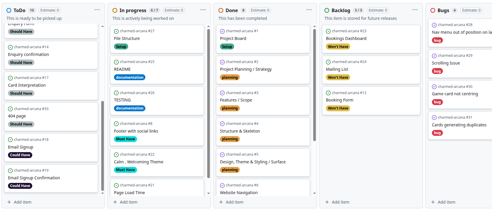

### GitHub Issues

[GitHub Issues](https://www.github.com/geraldine-mor/charmed-arcana/issues) served as an another Agile tool. There, I managed my User Stories and Milestone tasks, and tracked any issues/bugs.

| Link | Screenshot |
| --- | --- |
|  | 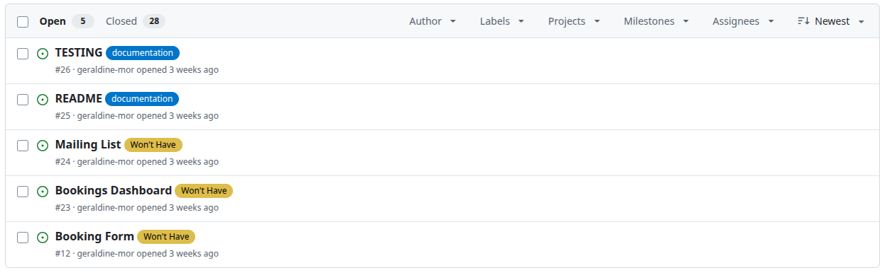 |
|  |  |

### MoSCoW Prioritization

I've decomposed my Epics into User Stories for prioritizing and implementing them. Using this approach, I was able to apply "MoSCoW" prioritization and labels to my User Stories within the Issues tab.

- **Must Have**: guaranteed to be delivered - required to Pass the project (*max ~60% of stories*)
- **Should Have**: adds significant value, but not vital (*~20% of stories*)
- **Could Have**: has small impact if left out (*the rest ~20% of stories*)
- **Won't Have**: not a priority for this iteration - future features

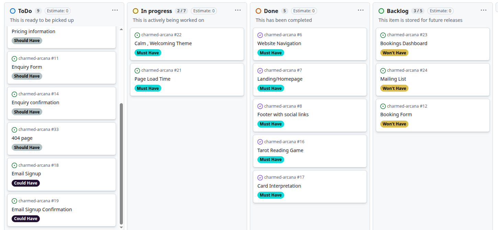

## Testing

> [!NOTE]  
> For all testing, please refer to the [TESTING.md](TESTING.md) file.

## Deployment

### GitHub Pages

The site was deployed to GitHub Pages. The steps to deploy are as follows:

- In the [GitHub repository](https://www.github.com/geraldine-mor/charmed-arcana), navigate to the "Settings" tab.
- In Settings, click on the "Pages" link from the menu on the left.
- From the "Build and deployment" section, click the drop-down called "Branch", and select the **main** branch, then click "Save".
- The page will be automatically refreshed with a detailed message display to indicate the successful deployment.
- Allow up to 5 minutes for the site to fully deploy.

The live link can be found on [GitHub Pages](https://geraldine-mor.github.io/charmed-arcana).

### Local Development

This project can be cloned or forked in order to make a local copy on your own system.

#### Cloning

You can clone the repository by following these steps:

1. Go to the [GitHub repository](https://www.github.com/geraldine-mor/charmed-arcana).
2. Locate and click on the green "Code" button at the very top, above the commits and files.
3. Select whether you prefer to clone using "HTTPS", "SSH", or "GitHub CLI", and click the "copy" button to copy the URL to your clipboard.
4. Open "Git Bash" or "Terminal".
5. Change the current working directory to the location where you want the cloned directory.
6. In your IDE Terminal, type the following command to clone the repository:
	- `git clone https://www.github.com/geraldine-mor/charmed-arcana.git`
7. Press "Enter" to create your local clone.

Alternatively, if using Ona (formerly Gitpod), you can click below to create your own workspace using this repository.

**Please Note**: in order to directly open the project in Ona (Gitpod), you should have the browser extension installed. A tutorial on how to do that can be found [here](https://www.gitpod.io/docs/configure/user-settings/browser-extension).

#### Forking

By forking the GitHub Repository, you make a copy of the original repository on our GitHub account to view and/or make changes without affecting the original owner's repository. You can fork this repository by using the following steps:

1. Log in to GitHub and locate the [GitHub Repository](https://www.github.com/geraldine-mor/charmed-arcana).
2. At the top of the Repository, just below the "Settings" button on the menu, locate and click the "Fork" Button.
3. Once clicked, you should now have a copy of the original repository in your own GitHub account!

### Local VS Deployment

When testing the project on safari devices there was an issue with a chosen glyph not rendering. This has been explained in detail in the testing file but it did require a style change to ensure that the page displayed equally well across all browsers.

There are no remaining major differences between the local version when compared to the deployed version online.

## Credits

### Content

| Source | Notes |
| --- | --- |
| [Markdown Builder](https://markdown.2bn.dev) | Help generating Markdown files |
| [Coolors](https://coolors.co/221133-ddffe0-cab185-beb7df-aac6d7) | Creation of colour palette (further details provided [above](#colour-scheme)) |
| [Google Fonts](https://fonts.google.com/specimen/Cinzel+Decorative?preview.text=CHARMED%20ARCANA&query=Cinzel) | Body fonts (further details provided [above](#typography)) |
| [Stack Overflow](https://stackoverflow.com/questions/46404894/how-do-i-rotate-an-icon-with-css-on-hover)   [w3 Schools](https://www.w3schools.com/css/css3_3dtransforms.asp)| Help to create spinning icon effect on hover (footer) |
| [Colour Code Converter](https://htmlcolorcodes.com/hex-to-rgb/) | Find rgb values of colours to allow for transparent variations |
| [w3 Schools](https://www.w3schools.com/howto/howto_css_flip_card.asp) | Card flip tutorial for tarot game card reveal  |
| [w3 Schools](https://www.w3schools.com/w3css/w3css_slideshow.asp)   [w3 Schools](https://www.w3schools.com/howto/howto_js_slideshow.asp)   [w3 Schools](https://www.w3schools.com/css/tryit.asp?filename=trycss_css_image_overlay_slideright)   [Stack Overflow](https://stackoverflow.com/questions/25044754/css-javascript-slide-div-out-and-slide-div-in) | Slideshow assistance for next card animation on the mobile tarot game |
| [Stack Overflow](https://stackoverflow.com/questions/11660710/css-transition-fade-in) | Fade in effect |
| [w3 Schools](https://www.w3schools.com/howto/howto_css_modals.asp) | Modal tutorial for the email signup modal |
| [ChatGPT](https://chatgpt.com) | Help with code logic and explanations - See [below](#ai-use) |

### Media

| Source | Notes |
| --- | --- |
| [flaticon.com](https://www.flaticon.com/free-icon/crescent-moon_12556544?term=tarot&page=1&position=85&origin=search&related_id=12556544) | Moon and star logo used in header and favicon |
| [favicon.io](https://favicon.io) | Generating the favicon |
| [Png Tools](pngtools.com) | Changing the colour of the icon to suit the theme |
| [Font Awesome](https://fontawesome.com) | Icons used throughout the site |
| [Pexels](https://www.pexels.com/photo/tarot-cards-near-burning-plants-in-close-up-photography-7947733/) | Homepage banner image | 
| [Pexels](https://www.pexels.com/photo/a-woman-holding-a-deck-of-tarot-cards-11760488/) | Homepage about image |
 [Adobe Firefly](https://firefly.adobe.com/generate/image) | Tarot deck generated with AI |
| [Labrythos](https://labyrinthos.co/blogs/tarot-card-meanings-list) | Card design inspiration and text content | 
| [Pexels](https://www.pexels.com/photo/hands-touching-the-tarot-cards-on-the-table-6014326/) | Tarot reading services card image |
| [Pexels](https://www.pexels.com/photo/a-person-in-yoga-position-beside-a-woman-lying-on-floor-6998244/) | Guided meditation services card |
| [Adobe Friefly](https://firefly.adobe.com/generate/image) | Remaining services cards images generated with AI |
| [Adobe Firefly](https://firefly.adobe.com/generate/image) | Background image of a shop generated with AI |
| [Boardwalk Games](https://codeinstitute.net/ie/) | Inspiration for the contact details footer |
| [Pexels](https://www.pexels.com/photo/road-surrounded-by-bare-trees-1632793/) | 404 page background image |
| [TinyPNG](https://tinypng.com) | Compressing images < 5MB |
| [ImageResizer](https://imageresizer.com/bulk-resize/download/692d80156e603aac1b970097) | Resizing images and compressing images > 5MB |
| [Convertio](https://convertio.co/) | Converting images to `.webp` |

### AI Use

This project was my first real exploration into using AI to assist with a website build. 

I primarily used [chatGPT](https://www.chatgpt.com) switching to [Claude](httpd://www.claude.ai) any time I ran out of chats on chatGPT or if I felt like I needed another answer to compare for accuracy of information. I used [Adobe Firefly](https://firefly.adobe.com/generate/image) for all image creation.

In the planning stages, I used AI to help generate the user stories and during the build I frequently used AI to generate text content such as the about sections and services details, image content such as the tarot deck and the services cards. I rarely copied the text exactly but it did help provide ideas and direction.

AI and troubleshooting: I used AI when my own attempts at troubleshooting had failed. Copying and pasting my code in to see where I had gone wrong. AI was not always correct but always pointed me in the right direction. 

I ensured any explanations didn't include code by writing explicitly into the promt that I required explanations only and not code such as the below example:

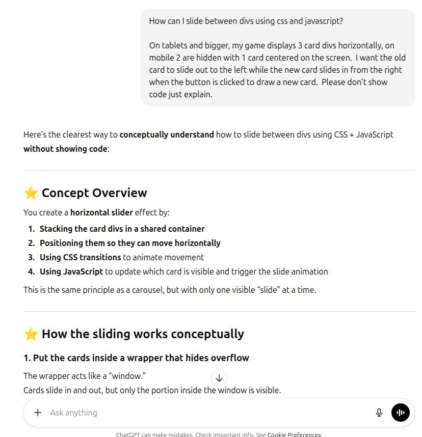

_The sole exception to this was in figuring out how to block past dates on the date picker and is credited directly in a comment._

I leaned heavily on AI for any areas that I felt would be provided by the client in a real-world build (branding, text & image content) and used it more as a tutor and assistant for everything else. Using AI on this project certainly sped up the build process and allowed me to include more of my desired features.

### Acknowledgements

- I would like to thank my Code Institute mentor, Rory Sheridan for his support with this project.
- I would like to thank the [Code Institute](https://codeinstitute.net) without them I wouldn't have the skills to begin this project.
- I would like to thank the [Code Institute Discord community](https://discord-portal.codeinstitute.net) for the moral support; it kept me going during periods of self doubt and impostor syndrome.
- I would like to thank my partner Niall, for believing in me, and allowing me to make this transition into software development.
- I would like to thank my family for picking up the slack during project work allowing me to remain focused.

